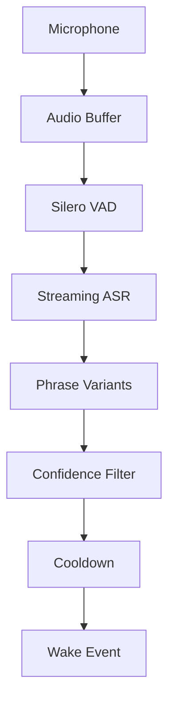
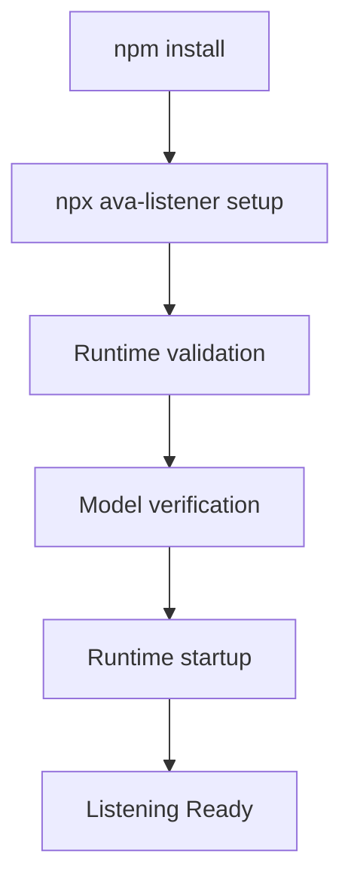

<div align="center">
  <h1>🎙️ AVA-Listener</h1>
  <p><strong>AVA-Listener is an offline, transcription-driven wake phrase runtime designed for flexible custom AI assistants without requiring model retraining.</strong></p>

  [](https://www.npmjs.com/package/ava-listener)
  [](https://www.npmjs.com/package/ava-listener)
  [](https://github.com/atharvpatil2748/ava-listener/releases)
  [](https://opensource.org/licenses/MIT)
  []()
  []()
</div>

---

## 🚀 Quick Start

Get up and running with zero manual model installation or runtime setup. Built-in profiles are intended as starting templates. Copy and customize them rather than editing files inside node_modules.

Jump to: [Getting Started with Profiles](#-getting-started-with-profiles) | [Profile Schema](#-profile-schema) | [Debug Mode](#-debug-mode)

### Step 1: Install

```bash
npm install ava-listener
npx ava-listener setup
```

What setup does automatically:
- Creates required runtime directories
- Verifies package structure
- Downloads required speech models
- Validates model SHA256 hashes
- Prepares the local runtime cache

### Step 2: Copy a built-in profile

AVA-Listener ships with built-in starter profiles:

```text
node_modules/
└── ava-listener/
    └── profiles/
        ├── arvsal.json
        ├── jarvis.json
        ├── base.json
        └── custom.json
```

Choose one and copy it into your own project:

Windows:

```powershell
Copy-Item `
node_modules\ava-listener\profiles\arvsal.json `
.\arvsal.json
```

Linux/macOS:

```bash
cp node_modules/ava-listener/profiles/arvsal.json ./arvsal.json
```

You can now edit:

* assistantName
* wake phrases
* variants
* thresholds
* cooldown values

### Step 3: Start listening

```javascript
const { AVAListener } = require("ava-listener");
const path=require("path");

async function run(){

    const listener=new AVAListener({
        profile:path.join(
            __dirname,
            "arvsal.json"
        ),
        debug:true
    });

    listener.on(
        "bootstrap-start",
        ()=>console.log(
            "[BOOTSTRAP]"
        )
    );

    listener.on(
        "runtime-ready",
        ()=>console.log(
            "[RUNTIME READY]"
        )
    );

    listener.on(
        "wake",
        (e)=>console.log(
            "Wake:",
            e
        )
    );

    listener.on(
        "partial",
        (t)=>console.log(
            "[ASR]",
            t
        )
    );

    listener.on(
        "error",
        console.error
    );

    await listener.start();

}

run().catch(console.error);
```

`debug:true` enables live transcription logs and is recommended during initial wake phrase tuning.

Disable debug mode in production deployments.

Useful events exposed by AVA-Listener:
- bootstrap-start
- runtime-ready
- wake
- partial
- error

## 📦 Model Storage

Downloaded models are cached locally and reused automatically.

Windows:
```text
%LOCALAPPDATA%/AVAListener/models/
```

Linux/macOS:
```text
~/.local/share/AVAListener/models/
```

* Models download only once
* Future startups reuse cache
* Users may manually delete cache if they want forced redownloads

---

## 📖 Why it is called AVA-Listener

**AVA** stands for **ARVSAL Voice Activation**.

**ARVSAL** is the personal AI assistant system that originally motivated this project. AVA-Listener began as the listening and wake-word layer of ARVSAL. Over time, it evolved into an independent, reusable runtime for custom voice activation, capable of powering any assistant without locking you into a single assistant name.

---

## 🤔 The Problem with Custom Wake Words

When building local AI assistants, AVA-Listener was designed to address the limits of current wake-word tooling.

* **Picovoice Porcupine**: An excellent project, but it has increasingly shifted toward enterprise workflows and introduces access friction for individual developers.
* **OpenWakeWord**: A strong open-source solution for many standard phrases, but custom uncommon words often require a training workflow or dataset creation.

Custom phrases such as:
* `"ARVSAL"`
* `"Jarvis"`
* `"Activate Protocol"`
* `"Computer Prime"`
* `"Project Athena"`

can be difficult because ASR often transcribes them differently. This happens due to:
* **Pronunciation ambiguity**
* **Uncommon phonetics**
* **Accent variations**
* **Transcription drift**

---

## 🔤 Why "ARVSAL" is difficult

ARVSAL is not a common English word. Most ASR engines will have difficulty transcribing it accurately, especially across different speakers, accents, and environmental conditions.

A speech sample of someone saying "ARVSAL" might be transcribed as:
* `"arvsal"`
* `"arsal"`
* `"arsel"`
* `"aircel"`
* `"our whistle"`

Why does this happen?

* **Uncommon phonetics** — ARVSAL has no common English phoneme patterns.
* **Accent variations** — Different speakers pronounce it differently.
* **Speech rate** — Fast or slow speech changes how phonemes map to tokens.
* **Background noise** — Microphone quality and ambient sound affect transcription.
* **ASR token ambiguity** — The model may emit different token sequences for the same utterance.

Instead of forcing users to record training data and retrain an acoustic model, AVA-Listener embraces this challenge through **variants**.

You define `ARVSAL` once, then register likely alternatives the ASR might produce. The runtime then matches transcriptions against all registered variants and fires a wake event when confidence is high.

This approach is faster to configure, requires no data collection, and works immediately.

---

## 🧠 AVA Philosophy

**AVA does not depend on training a neural model per wake word.**

AVA-Listener uses streaming ASR as the foundation, then applies transcription matching and fuzzy phrase logic.

Pipeline:
`Speech` → `ASR` → `Transcription` → `Variants` → `Scoring` → `Confidence Filter` → `Event`

This is the core design philosophy of the package. It means wake phrases are defined as text and variants, not as new acoustic models. That gives you fast iteration and flexible phrase control without dataset collection.

---

## 🕊️ Wake Phrase Freedom

AVA-Listener is built for free-form wake phrase design.

Supported phrase styles:
* **Single words**: `"jarvis"`, `"computer"`, `"echo"`
* **Multiple words**: `"activate protocol"`, `"hello assistant"`
* **Complete sentences**: `"hello arvsal can you wake up"`
* **Fictional names**: `"ultron"`, `"hal"`
* **Invented words**: `"arvsal"`, `"snoodle"`
* **Technical commands**: `"start diagnostic mode"`, `"shutdown system"`

No retraining. No dataset creation. No hundreds of recordings.

---

## ⚙️ Advanced Wake Phrase Logic

AVA-Listener combines multiple runtime controls:
1. **Phrase** — the canonical target text.
2. **Variants** — alternate ASR transcriptions.
3. **Threshold** — per-phrase trigger sensitivity.
4. **EMA smoothing** — reduces false spikes.
5. **Cooldown** — prevents repeated triggers.
6. **Debug mode** — helps you tune phrases quickly.

---

## 🏗️ Architecture

AVA-Listener orchestrates several subsystems to detect custom wake phrases offline.

### Speech Processing Pipeline



### Startup Flow



---

## 🚀 Package Usage

The canonical package workflow is the real SDK usage that ships with `ava-listener`.
Attach listeners before calling `start()` so lifecycle, bootstrap, download, runtime, and wake events are all captured.

```javascript
const { AVAListener } = require("ava-listener");
const path = require("path");

async function run() {

    const listener = new AVAListener({
        profile: path.join(
            __dirname,
            "arvsal.json"
        ),
        debug: true
    });

    listener.on(
        "bootstrap-start",
        () => console.log("[BOOTSTRAP]")
    );

    listener.on(
        "download-progress",
        (x) => console.log(
            "[DOWNLOAD]",
            x
        )
    );

    listener.on(
        "runtime-ready",
        () => console.log("[RUNTIME READY]")
    );

    listener.on(
        "wake",
        (e) => console.log(
            "\nWAKE:",
            e
        )
    );

    listener.on(
        "partial",
        (t) => console.log(
            "[ASR]",
            t
        )
    );

    listener.on(
        "error",
        (e) => console.error(
            "[ERROR]",
            e
        )
    );

    await listener.start();
}

run().catch(console.error);
```

## Event System

AVA-Listener emits runtime events during startup, model management, ASR streaming, wake detection, and runtime errors.

| Event | Description |
| :--- | :--- |
| `bootstrap-start` | Runtime startup sequence begins |
| `download-progress` | Model download/update progress |
| `runtime-ready` | Runtime initialized |
| `wake` | Wake phrase detected |
| `partial` | Live streaming ASR text |
| `error` | Runtime errors |

## Creating Profiles

Profiles are JSON files that define the assistant name, profile version, and wake phrase registry.

```json
{
  "assistantName":"AssistantName",
  "profileVersion":1,
  "wakePhrases":[]
}
```

Field reference:

* `assistantName` — human-friendly assistant label shown in diagnostics and logging.
* `profileVersion` — schema version for profile validation.
* `wakePhrases` — array of phrase definitions.
* `phraseId` — unique identifier for each wake phrase.
* `phrase` — canonical target text for the wake phrase.
* `variants` — alternate ASR transcriptions that should also trigger the same phrase.
* `threshold` — per-phrase trigger sensitivity.
* `cooldownMs` — minimum time in milliseconds before the same phrase may trigger again.
* `enabled` — whether the phrase is active.

## 🧪 ARVSAL Example

This is the real ARVSAL profile from `profiles/arvsal.json`.

```json
{
  "assistantName": "Arvsal",
  "profileVersion": 1,
  "wakePhrases": [
    {
      "phraseId": "arvsal_core",
      "phrase": "arvsal",
      "variants": [
        "arvsal",
        "arsal",
        "arzal",
        "arsel",
        "armsel",
        "arv sal",
        "ar sal",
        "our whistle",
        "or whistle",
        "ourvsel",
        "aircel",
        "ahsal",
        "arv"
      ],
      "threshold": 0.72,
      "cooldownMs": 2000,
      "enabled": true
    },
    {
      "phraseId": "hey_arvsal",
      "phrase": "hey arvsal",
      "variants": [
        "hey arvsal",
        "hey arsal",
        "hey arsel",
        "hey armsel",
        "hey arzal",
        "hey ar sal",
        "he arbezal",
        "hey our whistle",
        "hey or whistle",
        "wake up our whistle",
        "wake upon whistle"
      ],
      "threshold": 0.68,
      "cooldownMs": 2000,
      "enabled": true
    },
    {
      "phraseId": "wake_up_arvsal",
      "phrase": "wake up arvsal",
      "variants": [
        "wake up arvsal",
        "wake up arsal",
        "wake up arsel",
        "wake up our whistle",
        "wake upon whistle",
        "wreak up arvsal",
        "wreak up arsel",
        "wreak up our whistle"
      ],
      "threshold": 0.68,
      "cooldownMs": 2000,
      "enabled": true
    },
    {
      "phraseId": "listen_arvsal",
      "phrase": "listen arvsal",
      "variants": [
        "listen arvsal",
        "listen arsal",
        "listen arsel",
        "listen our whistle"
      ],
      "threshold": 0.72,
      "cooldownMs": 2000,
      "enabled": true
    },
    {
      "phraseId": "listen_buddy",
      "phrase": "listen buddy",
      "variants": [
        "list buddy",
        "listen bud",
        "listen bad",
        "listen badie"
      ],
      "threshold": 0.72,
      "cooldownMs": 2000,
      "enabled": true
    },
    {
      "phraseId": "listen",
      "phrase": "listen",
      "variants": [
        "listen",
        "his son",
        "son"
      ],
      "threshold": 0.72,
      "cooldownMs": 2000,
      "enabled": true
    }
  ],
  "extends": "base.json"
}
```

### Why variants exist

ARVSAL is an uncommon name. ASR may interpret it as:

* `arvsal`
* `arsal`
* `arsel`
* `our whistle`
* `aircel`

By registering these variants, the listener becomes robust to transcription drift.

## 🤖 Jarvis Example

This is the real Jarvis profile from `profiles/jarvis.json`.

```json
{
  "assistantName": "Jarvis",
  "profileVersion": 1,
  "wakePhrases": [
    {
      "phraseId": "jarvis_core",
      "phrase": "jarvis",
      "variants": [
        "jarvis",
        "jarvas",
        "jarbes",
        "jarvus",
        "jarbus",
        "jar vis"
      ],
      "threshold": 0.72,
      "cooldownMs": 2000,
      "enabled": true
    },
    {
      "phraseId": "hey_jarvis",
      "phrase": "hey jarvis",
      "variants": [
        "hey jarvis",
        "hey jarvas",
        "hey jarbes",
        "hey jarvus",
        "hey jar vis"
      ],
      "threshold": 0.68,
      "cooldownMs": 2000,
      "enabled": true
    },
    {
      "phraseId": "ok_jarvis",
      "phrase": "ok jarvis",
      "variants": [
        "ok jarvis",
        "okay jarvis",
        "ok jarvas",
        "okay jar vis"
      ],
      "threshold": 0.68,
      "cooldownMs": 2000,
      "enabled": true
    }
  ],
  "extends": "base.json"
}
```

### Multiple Wake Phrases

AVA supports many simultaneous phrases in the same profile. For example:

* `arvsal`
* `hey arvsal`
* `wake up arvsal`
* `jarvis`
* `computer`
* `activate protocol`
* `diagnostic mode`

Each phrase can have its own sensitivity, cooldown, and variant set. That makes the runtime scalable across friendly names, natural commands, and custom assistant invocations.

## 🔧 Advanced Event Usage

The SDK is event-driven and supports runtime control with profile and phrase updates.

```javascript
const { AVAListener } = require("ava-listener");
const path = require("path");

const listener = new AVAListener({
  profile: path.join(__dirname, "jarvis.json"),
  debug: true
});

listener.on("bootstrap-start", () => console.log("Bootstrap started"));
listener.on("runtime-ready", () => console.log("Runtime ready"));
listener.on("wake", (event) => console.log("Wake detected", event));
listener.on("partial", (text) => console.log("Partial transcript", text));
listener.on("error", (err) => console.error("Runtime error", err));

await listener.start();

await listener.loadProfile(path.join(__dirname, "arvsal.json"));

listener.addPhrase({
  phraseId: "activate_protocol",
  phrase: "activate protocol",
  variants: ["activate protocol", "activate pro to call"],
  threshold: 0.70,
  cooldownMs: 2000,
  enabled: true
});

listener.updateConfig({
  "confidence.defaultThreshold": 0.78
});
```

## 📂 Getting Started with Profiles

AVA-Listener includes built-in profiles:
```text
node_modules/ava-listener/profiles/
```

Examples:
```text
profiles/
├── arvsal.json
├── jarvis.json
├── base.json
├── custom.json
```

Users can:
* use existing profiles directly
* copy existing profiles
* modify them
* create entirely new profiles

Recommended workflow:

Step 1:
Copy:
```bash
cp node_modules/ava-listener/profiles/arvsal.json ./myassistant.json
```

Windows:
```powershell
Copy-Item `
node_modules\ava-listener\profiles\arvsal.json `
.\myassistant.json
```

Step 2:
Modify:
* assistantName
* phrases
* variants
* thresholds

Step 3:
Pass profile path:
```javascript
const listener=new AVAListener({
    profile:"./myassistant.json"
});
```

---

## 🧩 Profile Schema

```json
{
  "assistantName":"Arvsal",
  "profileVersion":1,
  "wakePhrases":[
    {
      "phraseId":"arvsal_core",
      "phrase":"arvsal",
      "variants":[
        "arvsal"
      ],
      "threshold":0.72,
      "cooldownMs":2000,
      "enabled":true
    }
  ]
}
```

| Field          | Type     | Description                   |
| -------------- | -------- | ----------------------------- |
| assistantName  | string   | Assistant display name        |
| profileVersion | integer  | Profile format version        |
| phraseId       | string   | Unique identifier             |
| phrase         | string   | Main wake phrase              |
| variants       | string[] | Alternative ASR outputs       |
| threshold      | float    | Match confidence threshold    |
| cooldownMs     | integer  | Ignore period after detection |
| enabled        | boolean  | Enable/disable phrase         |

---

## ✨ Creating Custom Profiles

Examples of custom profiles you can create:
* Jarvis
* ARVSAL
* Computer
* Athena
* Activate Protocol

Users can create unlimited profiles.

---

## 🛠 Debug Mode

Debug mode prints live transcription information.

Enable:
```javascript
const listener=new AVAListener({
    profile:"./arvsal.json",
    debug:true
});
```

**When to use:**
✅ Creating new wake words
✅ Improving accuracy
✅ Investigating false negatives
✅ Understanding ASR outputs
✅ Tuning thresholds

**When NOT to use:**
❌ Production deployment
❌ Minimal logging environments

---

## 📈 How Debug Improves Accuracy

Enable debug
↓
Speak phrase
↓
Observe:
```bash
[ASR] our whistle
```
↓
Recognize transcription drift
↓
Add:
```json
"our whistle"
```
to:
```json
variants:[]
```
↓
Retest

This is the recommended workflow for tuning uncommon words like:
ARVSAL, Jarvis, Athena, Ultron, Computer Prime, etc.

---

## 🎯 Best Practices

* Start with low phrase count
* Enable debug during setup
* Add common ASR mistakes to variants
* Tune threshold slowly
* Avoid extremely short one-syllable words
* Use cooldowns to prevent retriggers
* Disable debug in production

## 💡 Understanding Wake Profiles

A wake profile is not a separate acoustic model for each phrase. Instead, AVA-Listener uses ASR output and variant matching so that:

* speech is transcribed by Sherpa-ONNX,
* text is compared against the canonical phrase,
* alternate transcriptions are accepted via `variants`,
* scores are filtered by `threshold`,
* wake events are emitted when confidence is high.

This design avoids the need to train a different model for every new wake phrase.

---

## 🛠️ All User Controls

AVA-Listener exposes rich configuration at the SDK and profile levels.

### SDK Initialization Options
Passed to `new AVAListener(options)`:

| Name | Type | Default | Description | Example |
| :--- | :--- | :--- | :--- | :--- |
| `debug` | Boolean | `false` | Enable SDK debug logging. | `true` |
| `profile` | String | `null` | Path to load a JSON profile from startup. | `"./profiles/jarvis.json"` |
| `startPaused` | Boolean | `false` | Start in READY but do not activate detection. | `true` |

### Profile Options
Defined in JSON and loaded via `listener.loadProfile(path)`.

> When a child profile extends a parent, deep objects are merged automatically, but the `wakePhrases` array is replaced entirely by the child profile.

| Name | Type | Default | Description | Example |
| :--- | :--- | :--- | :--- | :--- |
| `extends` | String | `null` | Parent profile path for inheritance. | `"base.json"` |
| `assistantName` | String | `"Jarvis"` | Human-friendly assistant label. | `"ARVSAL"` |
| `vad.sileroThreshold` | Float | `0.15` | VAD confidence threshold for Silero. | `0.20` |
| `vad.aggressiveness` | Integer | `1` | VAD aggressiveness level. | `2` |
| `asr.numThreads` | Integer | `2` | Sherpa-ONNX thread count. | `4` |
| `confidence.defaultThreshold` | Float | `0.78` | Fallback phrase similarity threshold. | `0.80` |
| `confidence.emaRiseAlpha` | Float | `0.70` | EMA rise smoothing factor. | `0.85` |
| `confidence.emaDecayAlpha` | Float | `0.30` | EMA decay smoothing factor. | `0.15` |
| `confidence.cooldownSeconds` | Float | `2.0` | Global cooldown after a trigger. | `3.0` |
| `transcription.enableDebug` | Boolean | `false` | Emit live transcription diagnostics. | `true` |
| `diagnostics.enableInternalTrace` | Boolean | `false` | Enable deep runtime tracing. | `false` |

### Runtime Hot-Reload Controls
The runtime supports hot updates for these fields while active:
* `vad.sileroThreshold`
* `vad.aggressiveness`
* `confidence.defaultThreshold`
* `confidence.emaRiseAlpha`
* `confidence.emaDecayAlpha`
* `confidence.cooldownSeconds`
* `transcription.enableDebug`

Other fields such as `asr.modelPath`, `audio.sampleRate`, and thread settings require a restart.

### Phrase Controls
Used with `listener.addPhrase()` or profile JSON.

| Name | Type | Description | Example |
| :--- | :--- | :--- | :--- |
| `phraseId` | String | Unique identifier for the phrase. | `"jarvis_core"` |
| `phrase` | String | Canonical wake phrase text. | `"jarvis"` |
| `variants` | Array<String> | Alternate ASR transcriptions. | `["jarvas", "jarbes"]` |
| `threshold` | Float | Per-phrase trigger sensitivity. | `0.72` |
| `cooldownMs` | Integer | Phrase-specific cooldown in ms. | `2000` |
| `weight` | Float | Relative scoring priority. | `1.5` |
| `enabled` | Boolean | Enable or mute a phrase. | `true` |

---

## 🧩 Public API

AVA-Listener exposes these runtime controls through `new AVAListener()`.

### Lifecycle
* `start(profilePath?, opts?)` — boot runtime, verify models, launch Python supervisor, and connect transport.
* `pause()` — pause detection while keeping the runtime alive.
* `resume()` — resume detection from READY or PAUSED.
* `stop()` — gracefully shut down the runtime and supervisor.
* `restart()` — stop and start again using the current profile.
* `destroy()` — release resources and remove listeners.

### Configuration & Profiles
* `loadProfile(profilePath)` — load or reload a JSON profile at runtime.
* `validateProfile(profilePath)` — validate a profile file and return `{valid, errors, warnings}`.
* `updateConfig(patch)` — hot-patch supported runtime settings.
* `getEffectiveConfig()` — fetch the current merged profile/config values.
* `updateRuntimeParameters(params)` — alias for `updateConfig()`.
* `resetParameters()` — reset runtime-updatable values.

### Phrase Management
* `addPhrase(phraseObj)` — add a phrase to the active registry.
* `removePhrase(phraseId)` — remove a phrase by ID.
* `enablePhrase(phraseId)` — enable an existing phrase.
* `disablePhrase(phraseId)` — disable an existing phrase.
* `updateVariants(phraseId, variants)` — replace a phrase's variant list.
* `getPhrases()` — request the active phrase registry.

### Diagnostics
* `getState()` — returns the current state machine state.
* `getHealth()` — returns runtime health data.
* `getMetrics()` — returns metrics from the runtime.
* `getDiagnostics()` — returns diagnostic state information.
* `getManifest()` — returns the runtime handshake manifest.
* `getCapabilities()` — returns runtime capability flags.
* `enableExperimentMode()` — enable experiment mode if supported.

### Events
* `statechange` — emitted for every state transition.
* `ready` — emitted when the runtime reaches READY.
* `running` — emitted when detection becomes active.
* `paused` — emitted when detection is paused.
* `stopped` — emitted when the runtime stops.
* `failed` — emitted when startup or runtime failure occurs.
* `recovering` / `reconnected` — emitted during reconnect recovery.
* `wake` — emitted when ASR matching fires a wake event.

---

## 🖼️ Example Gallery

### Basic Usage
```javascript
const { AVAListener } = require('ava-listener');

async function run() {
  const listener = new AVAListener();

  listener.on('wake', (event) => {
    console.log(`Wake detected: ${event.phrase} raw=${event.raw_confidence} smooth=${event.smooth_confidence}`);
  });

  await listener.start();
}
run();
```

### Multiple Wake Phrases
```javascript
listener.addPhrase({
  phraseId: 'hey_computer',
  phrase: 'hey computer',
  variants: ['hey computer', 'a computer'],
  threshold: 0.70
});

listener.addPhrase({
  phraseId: 'cancel_action',
  phrase: 'cancel',
  variants: ['cancel', 'stop', 'abort'],
  threshold: 0.85
});
```

### ARVSAL Profile
```json
{
  "assistantName": "Arvsal",
  "profileVersion": 1,
  "wakePhrases": [
    {
      "phraseId": "arvsal_core",
      "phrase": "arvsal",
      "variants": [
        "arvsal",
        "arsal",
        "arzal",
        "arsel",
        "armsel",
        "arv sal",
        "ar sal",
        "our whistle",
        "or whistle",
        "ourvsel",
        "aircel",
        "ahsal",
        "arv"
      ],
      "threshold": 0.72,
      "cooldownMs": 2000,
      "enabled": true
    },
    {
      "phraseId": "hey_arvsal",
      "phrase": "hey arvsal",
      "variants": [
        "hey arvsal",
        "hey arsal",
        "hey arsel",
        "hey armsel",
        "hey arzal",
        "hey ar sal",
        "he arbezal",
        "hey our whistle",
        "hey or whistle",
        "wake up our whistle",
        "wake upon whistle"
      ],
      "threshold": 0.68,
      "cooldownMs": 2000,
      "enabled": true
    },
    {
      "phraseId": "wake_up_arvsal",
      "phrase": "wake up arvsal",
      "variants": [
        "wake up arvsal",
        "wake up arsal",
        "wake up arsel",
        "wake up our whistle",
        "wake upon whistle",
        "wreak up arvsal",
        "wreak up arsel",
        "wreak up our whistle"
      ],
      "threshold": 0.68,
      "cooldownMs": 2000,
      "enabled": true
    }
  ],
  "extends": "base.json"
}
```

### Jarvis Profile
```json
{
  "assistantName": "Jarvis",
  "profileVersion": 1,
  "wakePhrases": [
    {
      "phraseId": "jarvis_core",
      "phrase": "jarvis",
      "variants": [
        "jarvis",
        "jarvas",
        "jarbes",
        "jarvus",
        "jarbus",
        "jar vis"
      ],
      "threshold": 0.72,
      "cooldownMs": 2000,
      "enabled": true
    },
    {
      "phraseId": "hey_jarvis",
      "phrase": "hey jarvis",
      "variants": [
        "hey jarvis",
        "hey jarvas",
        "hey jarbes",
        "hey jarvus",
        "hey jar vis"
      ],
      "threshold": 0.68,
      "cooldownMs": 2000,
      "enabled": true
    },
    {
      "phraseId": "ok_jarvis",
      "phrase": "ok jarvis",
      "variants": [
        "ok jarvis",
        "okay jarvis",
        "ok jarvas",
        "okay jar vis"
      ],
      "threshold": 0.68,
      "cooldownMs": 2000,
      "enabled": true
    }
  ],
  "extends": "base.json"
}
```

### Debug Mode
```javascript
listener.updateConfig({
  'transcription.enableDebug': true
});
```

### Threshold Tuning
```javascript
listener.updateConfig({
  'confidence.defaultThreshold': 0.82
});
```

### Event Listeners
```javascript
listener.on('statechange', ({ from, to }) => console.log(`State: ${from} -> ${to}`));
listener.on('ready', () => console.log('READY'));
listener.on('wake', (e) => console.log(`WAKE ${e.phrase}`));
```

### Advanced Configuration
Use profile inheritance to preserve shared defaults while swapping wake phrases:
```json
{
  "extends": "base.json",
  "assistantName": "Project Athena",
  "wakePhrases": [
    {
      "phraseId": "athena_core",
      "phrase": "project athena",
      "variants": ["project athena", "project athen a"],
      "threshold": 0.70,
      "cooldownMs": 2500,
      "enabled": true
    }
  ]
}
```

---

## 📊 Benchmarks

Verified from `ava-listener/benchmarks/benchmark_summary.md` on Windows x64.

### System Baseline
| Metric | Value |
| :--- | :--- |
| `Cold Start` | `25483.00 ms` |
| `Warm Start` | `21344.00 ms` |
| `Worker Restart` | `4247.69 ms` |
| `Model Verification` | `2792.29 ms` |
| `Idle Memory` | `29.55 MB` |

### Optimization Snapshot
| Metric | Before | After |
| :--- | :--- | :--- |
| `process_scan_ms` | `2981.75` | `0.014` |
| `model_verify_ms` | `2792.29` | `11.234` |
| `startup_improvement_ms` | `5762.8` | — |
| `startup_improvement_percent` | `99.8%` | — |

### Runtime Resource View
| Cycle | RSS MB | Heap MB |
| :--- | :--- | :--- |
| 1 | `41.15` | `7.22` |
| 2 | `38.61` | `5.45` |
| 3 | `39.89` | `6.32` |
| 4 | `39.12` | `5.50` |
| 5 | `39.30` | `5.55` |

---

## 🚀 Installation & Usage

### NPM Package
```bash
npm install ava-listener
npx ava-listener setup
```

### Clone & Build
```bash
git clone https://github.com/atharvpatil2748/ava-listener.git
cd ava-listener
npm install
npm run setup-models
npm run verify
npm start
```

---

## 🩺 Troubleshooting

**Models not downloading**
Run `npx ava-listener setup` or `npm run setup-models`. AVA-Listener auto-generates `models/manifests/manifest.json` if it is missing.

**Microphone unavailable**
Grant microphone permission to your terminal/Node process and confirm a valid input device is present.

**False positives**
Increase `threshold` or `confidence.defaultThreshold`. Add more `variants` for mis-transcribed versions.

**False negatives**
Enable `transcription.enableDebug` and watch the transcriptions. Add the observed output to `variants`.

**Slow startup**
Use Node >= 18 and Python >= 3.10. Verify model downloads completed successfully.

---

## ❓ FAQ

**Why not train a custom model?**
Training an acoustic model requires data, infrastructure, and tuning. AVA-Listener achieves custom wake detection through transcription matching, which is faster to configure and avoids dataset collection.

**Can I use multiple phrases?**
Yes. You can register many phrases with their own thresholds, variants, and cooldowns.

**Can I use non-English phrases?**
The shipped Sherpa-ONNX model is English-focused, but you can still add non-English transcriptions as variants if the ASR produces them consistently.

**Can I run fully offline?**
Yes. The runtime itself is offline. Internet is required only for initial model setup (`npx ava-listener setup`).

**Can I create my own profile?**
Yes. Create a JSON profile in `profiles/` and load it with `listener.loadProfile(path)`.

---

## 🤝 Community

AVA-Listener started as the listening and wake-word layer of ARVSAL, a personal AI assistant system. Over time, it has evolved into an independent, reusable package for custom voice activation.

We welcome contributions from the community, from research to production improvements.

### Areas for Contribution

**Runtime & Performance**
* Optimizing startup latency and memory footprint
* Improving audio buffering and VAD algorithms
* Threading and concurrency enhancements
* Cross-platform testing (Linux, macOS, Windows ARM)

**Matching & Detection**
* Better phrase matching algorithms
* Confidence scoring improvements
* Multi-language support and non-English ASR models
* Advanced noise robustness

**Profiles & Examples**
* Community-contributed profiles for popular assistants
* Example integrations with smart home platforms
* Benchmarking across different hardware and microphones
* Accent and multilingual profile variants

**Documentation & Testing**
* Architecture documentation and design decisions
* Research experiments and academic papers
* Tutorial videos and integration guides
* Comprehensive test coverage

If you're interested in contributing, please open an issue or pull request. All contributions are appreciated.

---

## 💻 Development

To develop or modify the engine, use the built-in NPM scripts:

* `npm run setup-models` : Downloads the models.
* `npm run verify` : Performs a layout structure and manifest validity check.
* `npm start` : Runs `examples/manual_sdk_test.js` to immediately test microphone detection.
* `npm test` : Executes the test runner.

---

## 🗺️ Roadmap

* [x] Isolate runtime from hardcoded logic.
* [x] Implement dynamic JSON profile system.
* [x] Release Node.js NPM wrapper.
* [ ] Implement Rust-based audio capture backend to replace PyAudio dependencies.
* [ ] Formalize Plugin API for overriding the phrase matcher.
* [ ] WebUI configuration dashboard for tuning thresholds in real-time.

---

## 📄 License

Licensed under the **MIT License**. See `LICENSE` for details.

---

## 🙏 Acknowledgements

AVA-Listener stands on the shoulders of giants in the open-source speech community:
* **[Sherpa-ONNX](https://github.com/k2-fsa/sherpa-onnx)**: Provides the incredibly fast streaming ASR backbone.
* **[Silero VAD](https://github.com/snakers4/silero-vad)**: Highly accurate, lightweight voice activity detection.
* **[Picovoice](https://picovoice.ai/) & [OpenWakeWord](https://github.com/dscripka/openWakeWord)**: For inspiring the deep need for accessible, local voice activation infrastructure.
