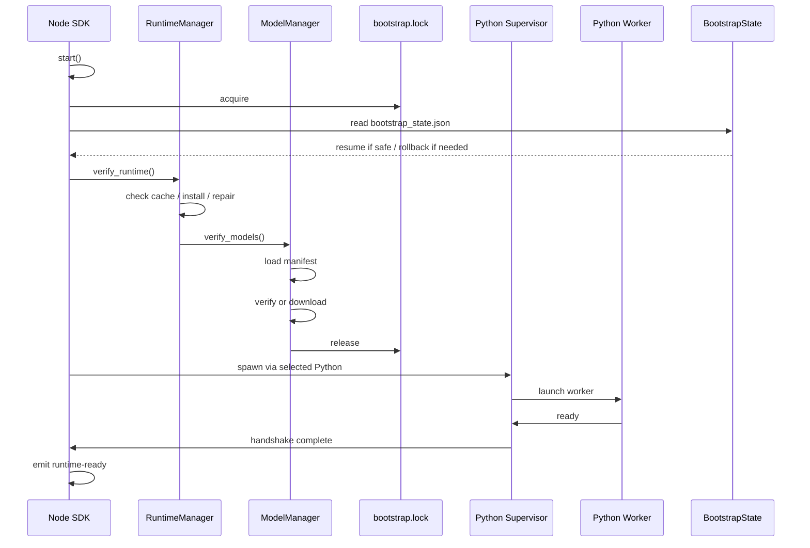

```mermaid
sequenceDiagram
    participant SDK as Node SDK
    participant RuntimeMgr as RuntimeManager
    participant ModelMgr as ModelManager
    participant Lock as bootstrap.lock
    participant Supervisor as Python Supervisor
    participant Worker as Python Worker

    SDK->>SDK: start()
    SDK->>Lock: acquire
    SDK->>BootstrapState: read bootstrap_state.json
    BootstrapState-->>SDK: resume if safe / rollback if needed
    SDK->>RuntimeMgr: verify_runtime()
    RuntimeMgr->>RuntimeMgr: check cache / install / repair
    RuntimeMgr->>ModelMgr: verify_models()
    ModelMgr->>ModelMgr: load manifest
    ModelMgr->>ModelMgr: verify or download
    ModelMgr->>Lock: release
    SDK->>Supervisor: spawn via selected Python
    Supervisor->>Worker: launch worker
    Worker->>Supervisor: ready
    Supervisor->>SDK: handshake complete
    SDK->>SDK: emit runtime-ready
```